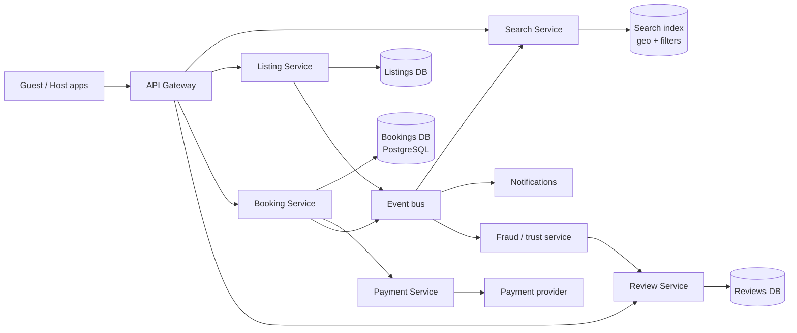
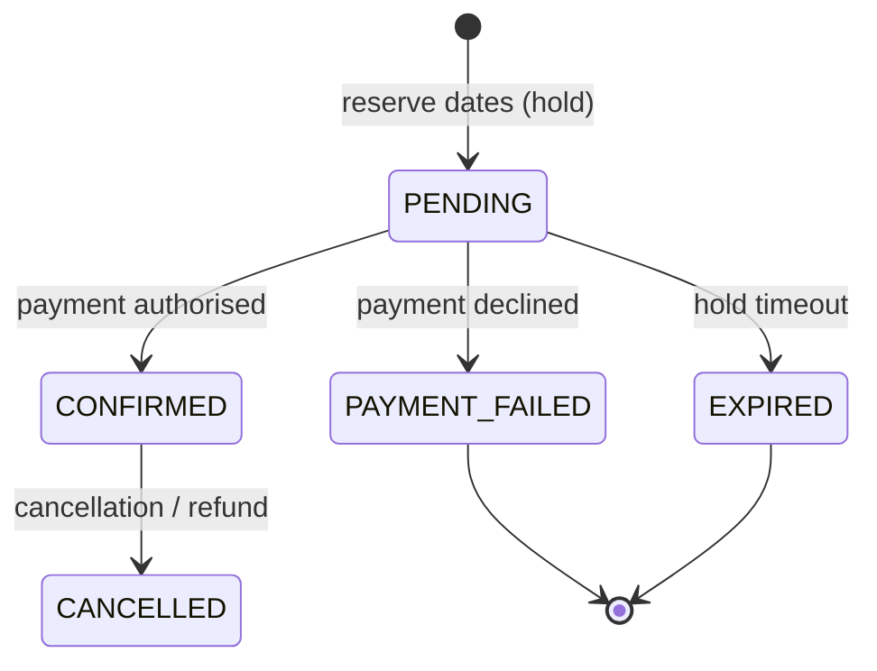

---
tags:
  - "system-design"
  - "search-eng"
---
## Interview Question

Design a **scalable system like Airbnb** that lets users discover and book short-term accommodation such as apartments, houses and private rooms.

Follow-up questions asked:

1. What happens if two users try to book the same property for the same dates at the same time?
2. What happens if the payment succeeds but booking creation fails?
3. What happens if the booking is created but the payment fails?
4. Which database would you use, and why?
5. How would you prevent fake reviews?

The design below is a preparation answer, not a record of what was said in the interview or of how Airbnb is built. PostgreSQL range constraints and Stripe's idempotency and manual-capture behaviour were checked on **27 September 2026**.

## Requirements

**Functional**

- Hosts create listings with photos, price, rules and an availability calendar.
- Guests search by location, dates, guests and filters, then view a listing.
- Guests book and pay; hosts and guests can cancel under a policy.
- Guests and hosts review each other after a stay.

**Non-functional**

- **No double bookings:** booking needs strong consistency.
- **Search is read-heavy** and can be slightly stale (seconds), so it can be served from a separate index.
- **Payments must be exactly-once from the user's view:** no double charges, no charge without a booking.
- High availability for search; correctness over availability for booking.

## High-Level Architecture



- **Search Service** answers "listings near X, available on these dates, for N guests", ranked by relevance. Listing and availability changes stream into the index through the event bus, so search is eventually consistent. See [[Agoda Search Service]] for caching and aggregation patterns, and [[Candidate Generation]] for the retrieve-then-rank idea.
- **Booking Service** is the source of truth for availability and runs the booking workflow.
- **Payment Service** wraps the payment provider and records every payment attempt.

## Booking Workflow

A booking moves through explicit states, stored in the database:



1. **Reserve first.** Insert a `PENDING` booking with an expiry (for example, 10 minutes). The database rejects it if the dates overlap another active booking.
2. **Authorise payment.** Place a hold on the card instead of charging it immediately. Stripe calls this manual capture: the amount is authorised and held, then captured later or cancelled to release it. Stripe's example is a hotel that authorises before arrival and captures at checkout.[^stripe-hold]
3. **Confirm.** On a successful authorisation, set the booking to `CONFIRMED` and publish an event.
4. **Capture** the funds at the policy point (for example, at booking or near check-in), before the authorisation expires; online card authorisations are typically valid for about 7 days, so long lead times need a charge or a new authorisation.[^stripe-hold]

Every call to the payment provider carries an **idempotency key** derived from the booking ID, so retries never charge twice. Stripe saves the result for a key and returns the same result for retries with that key.[^stripe-idem]

## Q1: Two Users Book the Same Dates at the Same Time

Let the database enforce it, so correctness does not depend on application timing.

**Overlap rule.** Stays are half-open date ranges $[\text{check-in}, \text{check-out})$, so a guest can check in on the day another checks out. Bookings $A$ and $B$ overlap exactly when:

$$
A_{\text{in}} < B_{\text{out}} \quad \text{and} \quad B_{\text{in}} < A_{\text{out}}
$$

**PostgreSQL exclusion constraint.** A `daterange` column with an exclusion constraint rejects any overlapping row for the same listing, atomically. PostgreSQL's documentation shows this pattern for room reservations, using the `btree_gist` extension to combine equality on the room with range overlap.[^pg-range] Sketch, not executed here:

```sql
CREATE EXTENSION IF NOT EXISTS btree_gist;

CREATE TABLE bookings (
    booking_id  uuid PRIMARY KEY,
    listing_id  bigint NOT NULL,
    guest_id    bigint NOT NULL,
    stay        daterange NOT NULL,          -- [check_in, check_out)
    status      text NOT NULL,               -- PENDING, CONFIRMED, ...
    expires_at  timestamptz,
    EXCLUDE USING gist (listing_id WITH =, stay WITH &&)
        WHERE (status IN ('PENDING', 'CONFIRMED'))
);
```

Both users send their insert. One commits; the other fails with an exclusion-constraint violation and is told the dates were just taken. The `WHERE` clause means expired or failed bookings stop blocking the dates.

**Alternatives:**

- **Per-night rows** in a calendar table with a unique key on `(listing_id, night)`: works in any SQL database, at the cost of one row per night.
- **Row lock:** `SELECT ... FOR UPDATE` on the listing, check for overlap, then insert. Correct, but serialises all bookings for that listing.
- **Distributed lock** (for example, Redis) only as an optimisation; the database constraint remains the final guard.

### Worked Example: Overlap Check

**Inputs:** an existing booking for 10–13 October, and two new requests: 13–15 October and 12–14 October. Dates are nights in October.

**Step 1: request 13–15 October.**

$$
10 < 15 \text{ but } 13 < 13 \text{ is false} \Rightarrow \text{no overlap}
$$

**Step 2: request 12–14 October.**

$$
10 < 14 \text{ and } 12 < 13 \Rightarrow \text{overlap}
$$

The first request is accepted, because its guest arrives on the day the existing guest leaves. The second is rejected, because the night of 12 October is already booked.

## Q2: Payment Succeeds but Booking Creation Fails

The workflow above makes this hard to reach, because the booking row (and its date hold) exists **before** any payment. The remaining failure is: authorisation succeeds, then the service crashes or the database write to `CONFIRMED` fails.

1. **Record the attempt first.** Before calling the provider, write a `payment_attempts` row (`booking_id`, idempotency key, `INITIATED`).
2. **Retry safely.** The Booking Service retries the confirmation; the payment call is repeated with the same idempotency key, so it returns the original result instead of charging again.[^stripe-idem]
3. **Listen to the provider.** Payment-success webhooks also drive the booking to `CONFIRMED`, so a crash on our side does not lose the outcome.
4. **Reconcile.** A periodic job compares provider records with bookings. For a successful authorisation without a confirmed booking:
   - If the hold is still valid, confirm the booking.
   - If the dates are gone (the hold expired and someone else booked), **cancel the authorisation** so the funds are released, or refund if already captured, and notify the guest.[^stripe-hold]

Because the money was only authorised, the usual compensation is releasing a hold, not issuing a refund. This is the **saga pattern**: a sequence of local transactions with compensating actions instead of one distributed transaction.

## Q3: Booking Created but Payment Fails

- On a decline, set the booking to `PAYMENT_FAILED`; the exclusion constraint no longer applies, so the dates are released immediately. The guest can retry with another card while a new hold is placed.
- If the payment outcome is **unknown** (timeout), do not release yet: query the provider using the idempotency key, and let the webhook or reconciliation job settle it.
- If nothing arrives, a sweeper marks `PENDING` bookings past `expires_at` as `EXPIRED`, releasing the dates. Holds must be short so abandoned checkouts do not block real guests.

## Q4: Which Database, and Why

Use different stores for different access patterns:

| Data | Store | Why |
|---|---|---|
| Bookings, payments, calendars | PostgreSQL (or another relational DB) | ACID transactions, exclusion or unique constraints, joins for reporting |
| Listings | Relational DB, with a cache | Structured data, moderate write rate, read-heavy |
| Search | Elasticsearch / OpenSearch | Geo queries, filters, full-text and relevance ranking |
| Hot reads (listing pages) | Redis / CDN | Latency and load reduction |
| Photos | Object store + CDN | Large immutable blobs |
| Events | Kafka | Decouples search indexing, notifications and fraud checks |

**Why relational for bookings:** the core invariant (no overlapping stays for one listing) is a constraint the database can enforce in one transaction, and payments need an auditable, consistent ledger.

**Scaling:** shard the bookings database by `listing_id`. All bookings that can conflict belong to one listing, so the overlap check never crosses shards. Guest-centred views ("my trips") are served from a replica or a secondary table keyed by `guest_id`, updated from events.

**Why not only a NoSQL store:** stores like Cassandra or DynamoDB scale writes well, but preventing overlapping ranges requires extra machinery such as conditional writes on per-night items. They fit high-volume, less transactional data such as messages or activity logs.

## Q5: Preventing Fake Reviews

1. **Only verified stays can be reviewed.** A review must reference a `CONFIRMED` booking whose check-out date has passed, and each booking allows one review per side. This removes most fake reviews, because each one now costs a paid stay.
2. **Time-limited, simultaneous reveal.** Allow reviews only for a fixed window after check-out, and hide both reviews until both parties submit or the window closes. This reduces retaliation and pressure to trade good reviews.
3. **Detect collusion.** Flag self-booking and review rings: the same device, payment instrument or IP address used by host and guest; clusters of new accounts reviewing the same hosts; bookings with abnormal patterns (very short stays, refunded after review).
4. **Detect content signals.** Near-duplicate text across reviews, bursts of 5-star reviews, and text that does not mention the listing's features.
5. **Model and review.** Combine these features in a fraud model; auto-hide high-risk reviews and send medium-risk ones to human moderators. Allow hosts and guests to report reviews.
6. **Rate limits and account trust.** Require verified identity, phone and payment before booking or reviewing.

Evaluate the fraud model on labelled moderation outcomes, reporting precision and recall at the chosen threshold; a false positive hides a genuine review, which also harms trust.

## Limitations & Pitfalls

- The search index can show a listing as available after it was booked; always re-check availability in the Booking Service before taking payment.
- Time zones: store stays as dates in the listing's local calendar, not as UTC timestamps.
- Prices and currency conversion must be fixed on the booking at the time of the hold, so the guest pays what they saw.
- Hold duration trades off guest convenience against blocking inventory.

## Open Questions

- TODO: add capacity estimates (listings, searches per second, bookings per day).
- TODO: search ranking for listings (personalisation, price, quality, conversion) was not covered; see [[Design a Personalized Search Recommendation System for Rapido]] for a related ranking design.

## Related Notes

- [[File Storage System]] — optimistic concurrency for a different kind of conflict.
- [[CAP Theorem]] — why booking favours consistency and search favours availability.

## References & Useful Links

[^pg-range]: [PostgreSQL documentation: Range types, section 8.17.10 Constraints on Ranges](https://www.postgresql.org/docs/current/rangetypes.html) — `daterange`, the `&&` overlap operator, exclusion constraints and the `btree_gist` room-reservation example.
[^stripe-idem]: [Stripe API: Idempotent requests](https://docs.stripe.com/api/idempotent_requests) — Retrying a request with the same idempotency key returns the saved result instead of repeating the operation.
[^stripe-hold]: [Stripe: Place a hold on a payment method](https://docs.stripe.com/payments/place-a-hold-on-a-payment-method) — Separate authorisation and capture, the hotel example, cancelling an authorisation, and authorisation validity windows.
