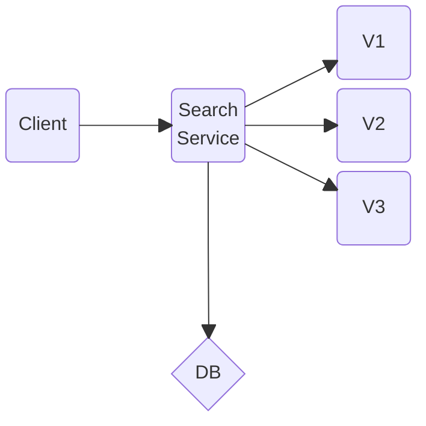
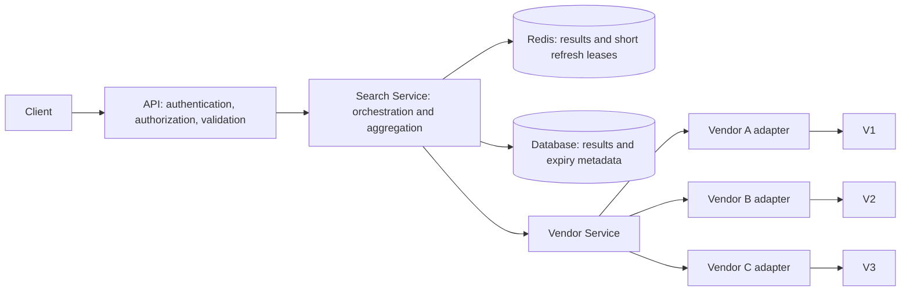
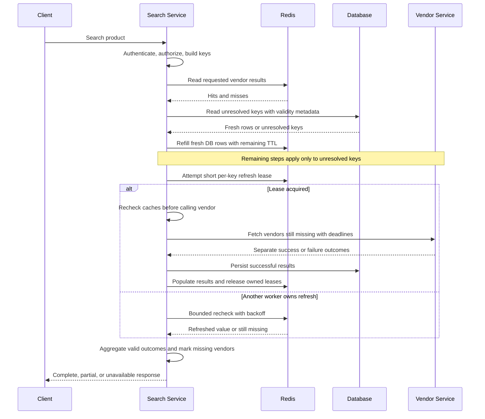
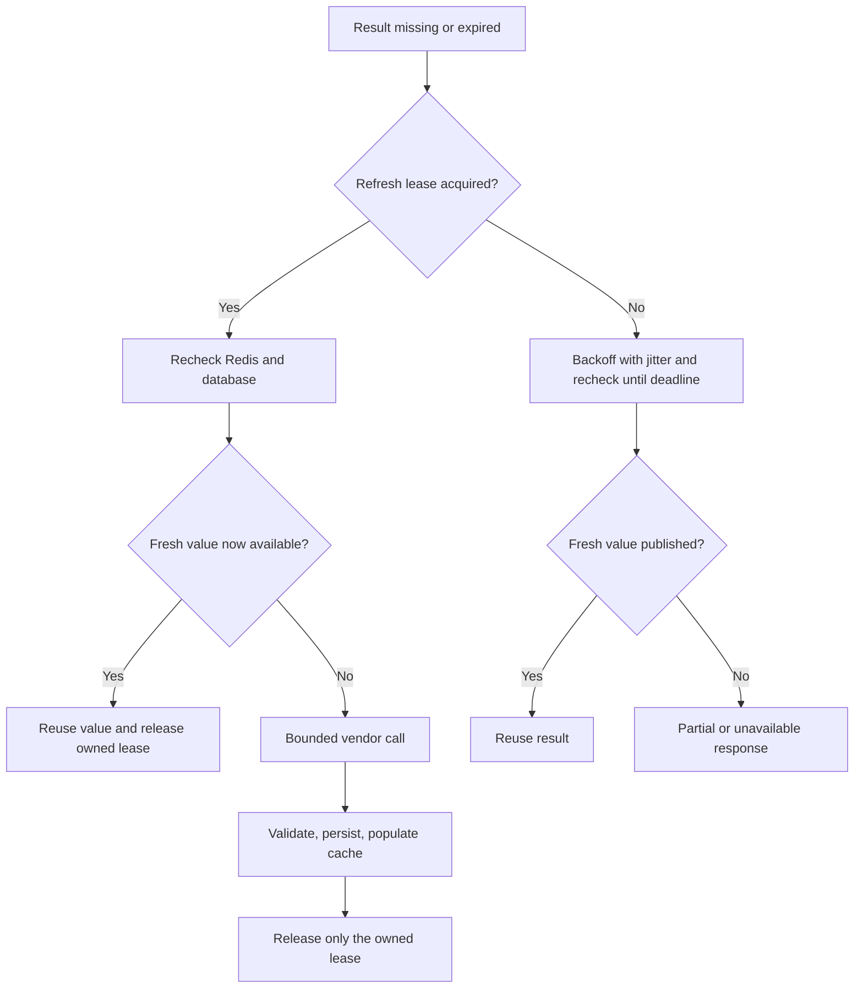
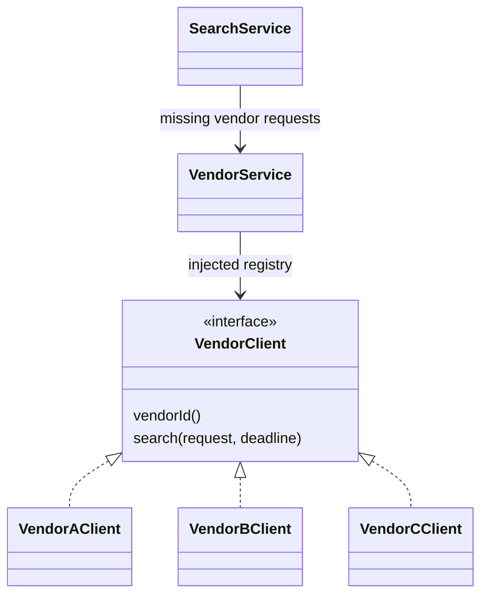

## Interview Question and Recollection

Design a **Search Service that calls multiple external vendors, aggregates their results, stores them, and returns a response**. Search results remain valid for **1 hour**.

The discussion covered Redis caching with a one-hour time to live (TTL), a cache key based on `(productId, vendorId)`, a persistent database fallback, a dedicated Vendor Service, cache stampedes after expiry, distributed coordination with Redis, database indexing, authentication, and service responsibilities.

In the Java code review, vendor-specific behavior appeared in an `if / else if` chain. **My suggestion was to introduce a common interface using the Strategy Pattern, with separate vendor implementations.** We also discussed the Single Responsibility Principle, dependency injection, maintainability, extensibility, parallel vendor calls, and readability.

**Testing was raised by the interviewer, but we were running short on time.** The testing section below is a preparation follow-up, not a claim that these cases were covered in the interview.

This note preserves the supplied interview account and architecture. Detailed freshness rules, failure policies, and implementation sketches are proposed extensions for revision; they do not describe Agoda's production implementation. Reference semantics were checked on **26 September 2026**.

## Original Architecture from the Screenshot

The Mermaid diagram keeps the screenshot's arrangement: **Client on the left, Search Service in the middle, V1–V3 on the right, and DB below Search Service**. The DB diamond is retained from the drawing; here it represents storage, not a decision. Arrows show calls/writes; return paths are omitted as in the original.



Mermaid's block layout makes the relative positions explicit instead of leaving the database's placement to flowchart auto-layout.[^mermaid]

> [!info]- Original interview sketch
> ![[Attachements/Agoda Search Service - Interview Architecture.png]]

## Clarify the Contract Before Extending the Design

The central question is not just “Can Redis hold this for an hour?” It is **“What makes a vendor result reusable, and from which time does that hour start?”**

For the worked design, assume:

- A successful vendor result is reusable for at most one hour from acquisition, or less if the vendor provides an earlier expiry.
- Results are cached per vendor, so one vendor's failure does not invalidate successful results from other vendors.
- The database persists each result with its original freshness metadata. Persistence does not make expired data valid again.
- Partial responses are allowed when at least one vendor succeeds; the response identifies missing vendors. This is a product assumption to confirm, not part of the supplied interview facts.
- Authentication and authorization apply before returning cached or newly fetched data.

> [!question]- What would I clarify with the interviewer?
> Ask whether the hour applies to each vendor result or the complete aggregate, whether stale or partial responses are allowed, which request fields change an answer, and what latency and vendor-rate limits must be met. These answers determine the cache and fallback contracts.

## Extended Architecture and Responsibilities

This diagram adds the caching and separation discussed in the interview. Redis and the Vendor Service are additions to the original sketch.



| Component | Responsibility |
|---|---|
| API boundary | Authenticate caller, authorize access, validate inputs, enforce request limits |
| Search Service | Select vendors, resolve cached data, coordinate refreshes, aggregate outcomes, construct response |
| Cache/result repository | Cache keys, serialization, expiry checks, database lookup and persistence |
| Vendor Service | Dispatch adapters, apply vendor-specific limits, normalize successful responses and errors |
| Vendor adapter | Vendor protocol, credentials, request mapping, response parsing, vendor error interpretation |
| Shared infrastructure | Connection pools, configuration, logging, tracing, metrics |

The Vendor Service can begin as a module with a clear interface. A separate deployment becomes useful for independent ownership, credentials, quotas, reuse, or scaling, but adds network latency and another failure boundary. **A code boundary and a deployment boundary are different decisions.** See [[Microservices]].

This resembles [[Search2.0 architecture]] in its thin API layer, orchestration, domain-owned interfaces, and infrastructure adapters. The external-vendor problem does not require that implementation's retrieval or ranking machinery.

## Cache Identity and the One-Hour Freshness Rule

### Start with Product and Vendor

Under the interview's simplified contract:

```text
result:v1:{productId}:{vendorId}
refresh:v1:{productId}:{vendorId}
```

The first key holds data. The second coordinates a short refresh attempt. **Its lease duration is not the one-hour data TTL.**

`(productId, vendorId)` is sufficient only when those inputs completely determine the reusable answer. If travel dates, occupancy, currency, locale, account-specific pricing, or tenant permissions affect the vendor response, incorporate their normalized values into the identity. These are examples to clarify, not extra facts about the interview question.

For larger contexts, use a versioned hash of a canonical representation. Use the same identity for Redis, database uniqueness, and refresh coordination. A lock keyed differently from the cached result can coordinate the wrong requests. See [[Search Caching]].

### Store Absolute Validity with the Payload

Suggested fields are `product_id`, `vendor_id`, optional context identity, `payload`, `fetched_at`, `expires_at`, and any vendor source version.

**Validity deadline**

$$
expires\_at=\min(fetched\_at+1\text{ hour},\ vendor\_expiry)
$$

Use the one-hour deadline when no vendor expiry is supplied. Define `fetched_at` consistently at successful acquisition; if the vendor's data was already old, preserve its earlier source validity instead of treating transport completion as a freshness guarantee.

**Remaining cache lifetime when loading a database row**

$$
TTL_{remaining}=\max(0,\ expires\_at-now)
$$

Check `now < expires_at` before serving. If caching with second precision, round the remaining TTL down; skip insertion when no positive lifetime remains. Retain `expires_at` in the payload and recheck it before response assembly.

Redis removes expired keys, but overwriting a value with a plain `SET` clears its prior TTL. Supply expiry with each replacement, or deliberately preserve it using an appropriate command option.[^expiry]

### Worked Example: Redis Miss, Fresh Database Row

- Vendor result acquired: **10:00**.
- Valid until: **11:00**.
- Redis entry missing at: **10:50**.
- Database row still contains the original result and deadline.

**Correct remaining validity**

$$
11{:}00-10{:}50=10\text{ minutes}=600\text{ seconds}.
$$

Serve the database result and cache it for at most 600 seconds. Giving it another 3,600 seconds would serve a 110-minute-old result at 11:50, violating the assumption.

> [!warning]- A database fallback is not automatically fresh
> At or after 11:00, this row is expired even though it still exists. Refresh it or return an explicit unavailable/partial outcome. Serving stale data would require a separately agreed policy; the one-hour contract does not imply one.

## End-to-End Request Flow

1. Authenticate, authorize, validate, and establish an overall deadline.
2. Determine the requested vendors and the complete cache identity for each.
3. Read Redis for those keys, preferably in a batch. Keep only valid results.
4. Batch-read the database for unresolved keys. Reuse fresh rows and refill Redis with their **remaining** lifetime.
5. For keys still unresolved, attempt refresh coordination separately per key.
6. After acquiring a refresh lease, recheck Redis/database: another worker may have completed the refresh since the initial miss.
7. Fetch only the missing vendors, concurrently within vendor-specific concurrency and rate limits.
8. Validate/normalize responses; persist successful results with their original validity metadata, then populate Redis.
9. Aggregate fresh successful results in a deterministic order, report vendor failures separately, and return within the request deadline.



A valid “no offers” response differs from a vendor timeout. Cache the former under an explicitly chosen policy; do not turn the latter into an empty successful result cached for an hour. If the aggregate itself is cached later, its validity must not outlive the earliest expiry among included results, and its identity must include the vendor set and response context.

## Cache Stampede and Distributed Coordination

If many instances see the same expired key simultaneously, each may query the same vendor. Adding application replicas can therefore increase vendor load precisely when the cache provides the least help.

### Combine Local Coalescing with a Short Redis Lease

**Local coalescing** lets requests in one process share an in-flight refresh. **Distributed coordination** reduces duplicate refreshes across processes. Scope both to the complete result key so unrelated products and vendors remain independent.

An illustrative Redis acquisition command is:

```text
SET refresh:v1:123:A unique-owner-token NX PX 5000
```

This attempts to acquire a five-second lease atomically. The duration is illustrative: choose it from the bounded vendor-call/write budget, with room for completion, rather than copying the result's one-hour TTL. Release only when the stored ownership token matches, using an atomic compare-and-delete operation or script. A plain `DEL` can remove another worker's lease.[^locks]



Waiters do not spin or all call the vendor when their wait budget expires. They recheck with bounded backoff and return the permitted partial/unavailable outcome. If an owner crashes, its lease eventually expires; a later attempt can acquire it and recheck before refreshing.

### Leases Reduce Duplicates; They Do Not Prove Exactly Once

A slow worker can continue after its lease expires. Redis failover with asynchronous replication can also allow competing owners.[^locks] For read-only vendor lookup, occasional duplicate fetches may be an accepted cost; do not use this assumption for bookings or payments.

Do not let a late refresh overwrite a newer accepted result. Where ordering matters, use a durable per-key refresh generation and conditional writes that reject older generations, and carry that version into cache publication. An ownership check alone is not a database fencing mechanism. A stronger coordinator is appropriate if duplicate work or overlapping ownership is unacceptable.

> [!tip]- Spread refresh work without extending validity
> Refresh ahead of hard expiry at a randomized earlier time, or expire selected cache entries earlier. Jitter must not push valid serving beyond the original one-hour deadline. While refreshing, the existing value may be served only while it remains valid.

## Database Model and Indexing

Illustrative **PostgreSQL** schema for the simplified two-field identity:

```sql
CREATE TABLE vendor_result (
    product_id text NOT NULL,
    vendor_id text NOT NULL,
    payload jsonb NOT NULL,
    fetched_at timestamptz NOT NULL,
    expires_at timestamptz NOT NULL,
    PRIMARY KEY (product_id, vendor_id),
    CHECK (expires_at > fetched_at)
);
```

```sql
SELECT vendor_id, payload, fetched_at, expires_at
FROM vendor_result
WHERE product_id = $1
  AND vendor_id = ANY($2::text[])
  AND expires_at > $3;
```

`$3` is the freshness-check time supplied by the service; check validity again before returning. Reject already expired vendor responses rather than inserting them. If additional request context changes the result, add its identity to the schema, query, and unique key together.

The composite key suits equality lookup by product/vendor and product-leading lookups. PostgreSQL multicolumn B-tree indexes are generally most efficient when predicates constrain leading columns; confirm the plan using representative data instead of assuming every query benefits equally.[^index]

An `expires_at` index may help a large cleanup job, but adds write/storage cost and is a separate access pattern. Expired rows can be retained for diagnostics or removed asynchronously; serving must enforce expiry regardless of cleanup timing. This sketch does not implement the optional refresh-generation mechanism described above.

## Java Code Review: Strategy Pattern and Dependency Injection

The supplied code was described as having logic similar to this **illustrative Java fragment**, rather than this being the original source:

```java
if (vendor == VendorId.A) {
    // Vendor A request and parsing logic
} else if (vendor == VendorId.B) {
    // Vendor B request and parsing logic
} else if (vendor == VendorId.C) {
    // Vendor C request and parsing logic
}
```

Branching itself is not the problem. The maintainability issue is accumulating multiple vendors' protocols, authentication, parsing, and error handling inside the orchestration method.

### Give Vendor Implementations a Common Contract



**Design sketch, not a complete implementation:** `SearchRequest`, `VendorResult`, `VendorId`, and `Deadline` are domain types. The deadline should represent a remaining monotonic time budget for outbound work. Each adapter must actually start nonblocking I/O or explicitly dispatch blocking I/O; returning a future alone does not make work parallel.

```java
import java.util.Map;
import java.util.concurrent.CompletableFuture;
import java.util.concurrent.CompletionStage;

interface VendorClient {
    VendorId vendorId();
    CompletionStage<VendorResult> search(
        SearchRequest request, Deadline deadline);
}

final class VendorService {
    private final Map<VendorId, VendorClient> clients;

    VendorService(Map<VendorId, VendorClient> clients) {
        this.clients = Map.copyOf(clients);
    }

    CompletionStage<VendorResult> fetch(
            VendorId vendor, SearchRequest request, Deadline deadline) {
        VendorClient client = clients.get(vendor);
        if (client == null) {
            return CompletableFuture.failedFuture(
                new IllegalArgumentException("Unsupported vendor: " + vendor));
        }
        return client.search(request, deadline);
    }
}
```

Composition code constructs `VendorAClient`, `VendorBClient`, and `VendorCClient` with their HTTP clients/configuration and injects the registry. Validate registry keys against adapter IDs and reject duplicate registrations at startup. Adding vendor D adds an implementation and registration while leaving the search orchestration flow intact.

| Principle | Concrete application |
|---|---|
| Strategy Pattern | Choose a vendor implementation through the same `VendorClient` contract |
| Single Responsibility Principle | Separate aggregation, persistence, and vendor protocol changes |
| Dependency injection | Supply adapters and repositories through constructors |
| Extensibility | Add a vendor implementation rather than expanding the central branch chain |
| Readability | Use named outcomes, short methods, explicit deadlines, and consistent error mapping |
| Testability | Replace a vendor with a fake that succeeds, fails, or delays deterministically |

### Parallel Calls Need Bounds and Failure Semantics

Launch independent missing-vendor requests before waiting for results. Apply an overall request deadline, smaller vendor budgets, per-vendor concurrency limits, and bounded queues. Normalize each completion into an outcome such as success, timeout, rate-limited, or invalid response so one failure does not silently discard all successful results.

For blocking clients, use an explicitly supplied, bounded executor rather than accidentally consuming the shared pool. In Java 21, `CompletableFuture` async methods without an explicit executor normally use the common fork-join pool. `allOf` does not collect typed results for you, and exceptional completion must be handled deliberately.[^java]

Timeout or cancellation of a future is not a guarantee that underlying HTTP work stops. `CompletableFuture.cancel` does not use interrupts to control processing; configure transport timeouts and propagate cancellation through the actual HTTP client where supported.[^java]

> [!example]- Parallelism changes the critical path, not the work done
> For independent vendor calls taking 100, 250, and 400 ms, serial calls take about 750 ms; concurrent calls take about 400 ms plus overhead if resources are available. Total outbound work remains, and vendor quotas still apply. See [[Tail Latency]].

## Authentication, Failures, and Response Semantics

Client authentication establishes identity; authorization determines allowed products, vendors, and account-specific results. A shared cache must not bypass those checks. Vendor credentials belong in adapter configuration backed by appropriate secret storage, not in the client request or cached payload.

Use internal service authentication for a separately deployed Vendor Service. Keep authorization scope in cache identity when responses differ by tenant or contract, and avoid logging credentials or sensitive vendor payloads.

| Situation | Proposed behavior |
|---|---|
| Redis miss, fresh DB row | Reuse row and refill only its remaining lifetime |
| Redis available, DB unavailable | Serve valid cache hits; refresh-only behavior follows persistence policy |
| Redis unavailable | Read fresh DB rows, coalesce locally, and strictly bound vendor refreshes; cross-instance Redis coordination is unavailable too |
| Redis and DB miss, vendor succeeds | Persist validated result, then populate Redis |
| DB write fails after vendor succeeds | Proposed default: do not acknowledge that vendor refresh as durably stored; return other successful results or an unavailable outcome |
| Redis write fails after DB succeeds | Return the durable fresh result; future requests can use the DB fallback |
| One vendor times out | Return allowed partial results with vendor status; never cache timeout as “no offers” |
| All vendors fail | Explicit unavailable response, not a successful empty list |
| Owner dies or lease expires | Bounded wait/retry, recheck data, and protect against obsolete writes |
| Result expires during aggregation | Omit or refresh within the remaining budget; do not extend its deadline |

The DB-write rule follows the problem's “stores them, and returns” wording. A different product could return a fresh but unpersisted response; that needs an explicit durability contract. Retries should target transient errors, remain inside the deadline, and respect vendor quotas. Avoid retries at every layer multiplying one request into many vendor calls.

## Testing Follow-up

The interviewer wanted to discuss testing, but the conversation ran short on time. These are the cases I would prepare next.

| Layer | Cases worth explaining |
|---|---|
| Unit: freshness | Valid immediately before expiry, invalid exactly at expiry; DB refill never restarts the hour |
| Unit: identity | Different products/vendors/context values remain isolated; equivalent normalized contexts reuse data |
| Unit: strategy registry | Correct adapter selected; unsupported vendor and invalid registrations handled |
| Unit: aggregation | Deterministic order, mixed success/failure, genuine empty response versus timeout |
| Adapter contract | Correct vendor auth/mapping, malformed payloads, rate limits, transport errors |
| Redis/DB integration | TTL applied on replacement, composite lookup, fresh versus expired fallback, persistence failure |
| Multi-instance concurrency | Many same-key misses normally share a refresh; unrelated keys proceed independently |
| Lease failure | Owner crashes; owner resumes after expiry; old owner cannot delete a new owner's lease |
| Load and resilience | Expiry burst, cold cache, Redis outage, slow vendor, full executor queue |
| Security | Unauthorized caller receives no data; tenant-specific cached results stay isolated |

Inject a controllable clock for freshness tests and use latches/barriers to force concurrency races. Test coordination against a real Redis instance and database in an isolated integration environment; mocks alone cannot establish atomicity, TTL, or multi-process behavior. Test ordinary coalescing separately from failure cases where duplicate refreshes are explicitly allowed.

Track per-vendor call count, cache hit rate, database fallback rate, refresh contention, rejected obsolete writes, p95/p99 latency, and partial/unavailable responses. A high hit rate can coexist with a poor miss-path tail. See [[Latency vs Throughput]] and [[Monitoring - MLOPS]].

## Revision Prompt

At 11:00, a popular product's result expires and 1,000 requests arrive across 20 instances. Vendor A is slow, vendor B succeeds, and Redis becomes unavailable. Explain what can still be returned, which coordination guarantees are lost, and how to avoid overwhelming the vendors.

> [!example]- Suggested reasoning
> Keep B's fresh result and any other still-valid values. The expired DB row does not become valid because Redis failed. Local coalescing still works within each instance, but Redis coordination no longer prevents cross-instance duplicate work. Apply vendor-wide capacity controls and bounded deadlines, then return a clearly partial or unavailable response rather than letting all waiters refresh independently.

## Related Notes

- [[Search Engineering]] — Navigation across reliable serving and search topics.
- [[System Design]] — Requirements, consistency, scaling, and failure boundaries.
- [[System_Design/Design a Personalized Search Recommendation System for Rapido|Rapido interview design]] — Another interview example with the same tags and separated domain responsibilities.

## References & Useful Links

The screenshot and interview recollection were supplied with this note. The references below support the technical explanations added for revision; no full original Java source was supplied, and the code sketches and test plan have not been executed.

[^mermaid]: [Mermaid: Block diagrams](https://mermaid.js.org/syntax/block.html) — Explicit columns, spaces, shapes, and connections for preserving the supplied architecture's relative layout.
[^expiry]: [Redis: EXPIRE](https://redis.io/docs/latest/commands/expire/) — Expiry semantics and the effect of overwriting values on existing TTLs.
[^locks]: [Redis: Distributed locks](https://redis.io/docs/latest/develop/clients/patterns/distributed-locks/) — Atomic lease acquisition, ownership-safe release, lease validity, and failover limitations. This note uses those primitives for refresh coordination, not as a claim of end-to-end exactly-once execution.
[^index]: [PostgreSQL: Multicolumn indexes](https://www.postgresql.org/docs/current/indexes-multicolumn.html) — Composite B-tree access patterns and leading-column considerations.
[^java]: [Oracle Java 21: CompletableFuture](https://docs.oracle.com/en/java/javase/21/docs/api/java.base/java/util/concurrent/CompletableFuture.html) — Executor selection, completion aggregation, and cancellation semantics.
