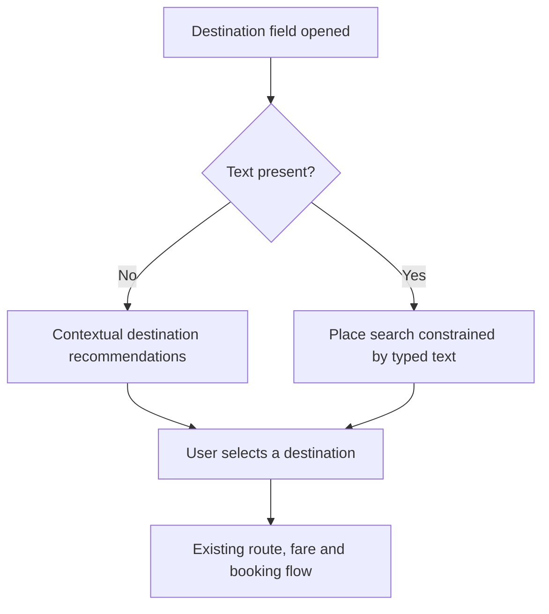
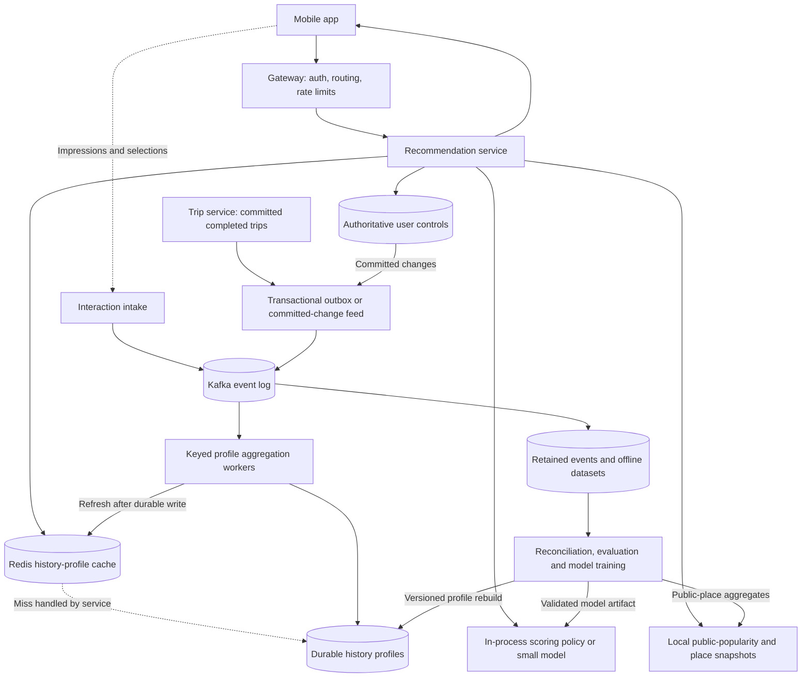
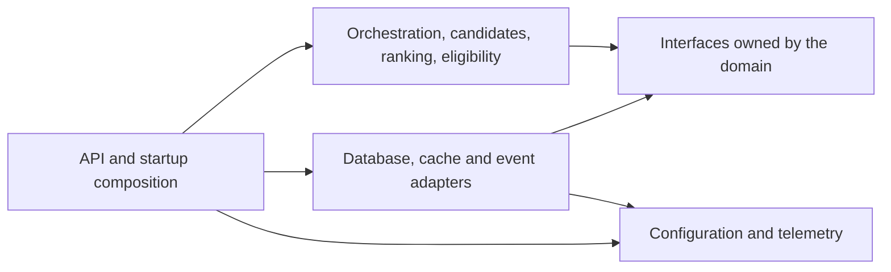
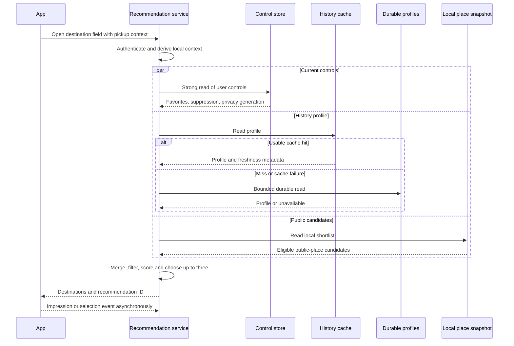
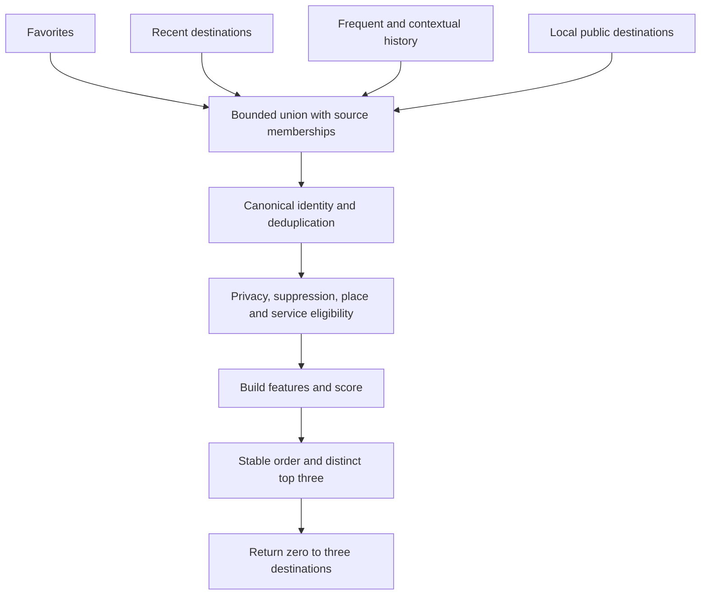
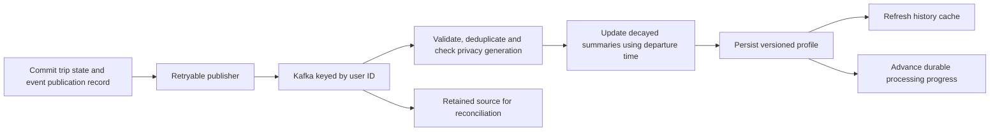
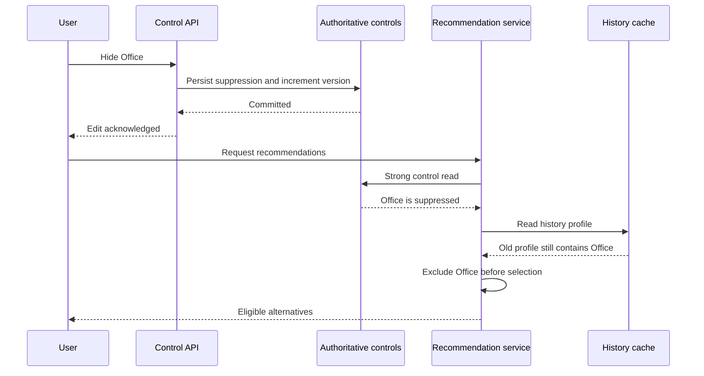
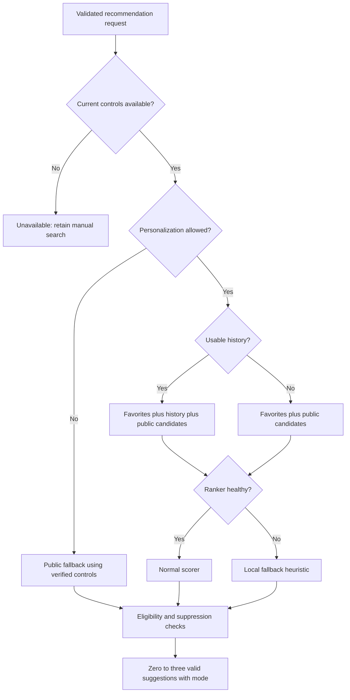
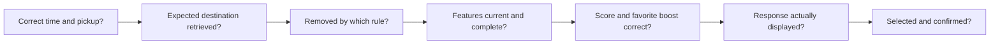

## Interview Brief

Design a system that recommends the **top 3 destinations when a user starts searching for a ride**. Personalization should consider day of week, time of day, frequency, recency, and favorite destinations. Favorites should receive higher priority while remaining sensitive to context: “Office” should rank highly on Monday morning when it is both a favorite and a regular weekday destination. Support cold-start users, changing behavior, low latency, and millions of users.

The discussion should cover **high-level design (HLD), technology trade-offs, domain separation, and scalability**.

This is a proposed interview solution, inspired by [[Search2.0 architecture]]. It does not describe Rapido's actual infrastructure. Workload numbers, score weights, limits, and service targets below are explicit design assumptions, not measured results. Technical references were checked on **26 September 2026**.

### The Opening Answer

“I would precompute a compact history profile for each user, then combine their favorites, recent destinations, frequent destinations, and suitable local public destinations at request time. A small ranker would score that bounded pool using the current pickup location and local time, with a contextual boost for favorites. Eligibility and deduplication would leave up to three distinct choices. Trip events would update profiles asynchronously, while explicit user edits would take effect through an authoritative control record.”

Read the HLD and request flow first, then the ranking example and trade-offs. Headings provide the main folding structure in Obsidian; collapsed callouts contain optional interview follow-ups.

## 1. Clarify the Product Contract

### What Does “Starts Searching” Mean?

Assume this is **zero-query recommendation**: the user opens the destination field before typing. The system predicts a useful destination from context. This differs from autocomplete, where typed text constrains the result set.

Once the user types, route to an existing place-search/autocomplete capability. Personal destinations can participate there, but “Office” should not win over a typed airport name merely because it is a favorite. The recommendation design can share identity, features, and ranking components with that path; building a worldwide place index is outside this question's core scope.



### Functional Requirements

- Return three distinct, eligible destinations when available; return fewer when there are insufficient valid choices.
- Use current pickup context, local day/time, historical trips, recency, frequency, and explicitly saved favorites.
- Give favorites a **soft ranking advantage**, not an unconditional first position.
- Support new users, sparse history, travelers, and users who disable personalization.
- Learn from later behavior and honor explicit favorite edits, hiding, and deletion.
- Keep manual destination search available even when recommendations are degraded.

The recommendation suggests a destination; it does not promise a driver, route, fare, or immediate vehicle availability. Those remain booking-domain responsibilities. Service-area eligibility can use an existing versioned policy snapshot, with final checks at booking.

> [!question]- What should I confirm with the interviewer?
> Confirm zero-query versus autocomplete, whether favorites are a boost or a pinned UI section, the acceptable history freshness, and whether the three slots must always be filled. If answers are unavailable, state the assumptions above and continue.

### Proposed Service Targets

| Concern | Interview assumption |
|---|---|
| Server latency | p95 ≤ 80 ms; p99 ≤ 150 ms within one serving region |
| Availability | 99.9% monthly recommendation API availability; measure fallback quality separately |
| Explicit edits | Reads started after a successful edit see the updated control record in its owning region |
| Trip-history freshness | 99% of accepted completed-trip events reflected within 60 seconds |
| Display count | At most 3; no duplicate or known ineligible destination |

Latency excludes the mobile network and rendering. Freshness starts when the authoritative event is accepted, not when an offline phone originally generated an interaction. An empty response may be valid for a user with no eligible candidates; it must not hide widespread dependency failures in the availability dashboard.

## 2. Transfer the Search2.0 Design Principles

The useful inspiration is the separation of **candidate generation, scoring, policy, and serving infrastructure**. A staged recommendation architecture is also described in Google's recommendation-system material.[^stages]

| Search2.0 principle | Application to this problem |
|---|---|
| Separate recall from reranking | Candidate generation finds plausible places; ranking chooses their order |
| Keep domain boundaries inside one deployable | Start with a modular recommendation service |
| Merge independent retrieval channels | Union favorites, recent trips, frequent places, and public local suggestions |
| Separate hard filters from boosts | Hidden or unserviceable places are excluded; favorites receive a score boost |
| Bound expensive work | Load compact profiles and rank a small pool |
| Make fallback behavior explicit | Record whether history, popularity, or a fallback scorer served the request |
| Diagnose stages separately | A missing candidate is different from a candidate ranked fourth |

The initial destination pool is small enough to rank directly. Dense embeddings, a vector database, an LLM, and remote cross-encoder inference are not prerequisites. Introduce richer retrieval only if evaluation shows that useful destinations are absent from the personal and local pools. See [[Candidate Generation]], [[Search Ranking]], and [[Search Architecture]].

## 3. Estimate the Workload Before Choosing Technology

Use these round numbers to make the interview concrete:

- 30 million registered users.
- 5 million daily active users.
- 8 destination-field openings per active user per day.
- A 10× peak-to-average traffic factor for planning.
- A mean 20 KB compact history profile, with bounded destination and context summaries.
- 1 million active profiles held in the distributed cache at a time.

**Daily requests**

$$
5{,}000{,}000\times8=40{,}000{,}000
$$

**Average request rate**

$$
QPS_{avg}=\frac{40{,}000{,}000}{86{,}400}\approx463.
$$

**Planning peak at 10 times the average**

$$
QPS_{peak}\approx4{,}630.
$$

**Profile and cache payloads**

$$
30{,}000{,}000\times20\text{ KB}=600\text{ GB}
$$

$$
1{,}000{,}000\times20\text{ KB}=20\text{ GB}
$$

These use decimal units and exclude replication, keys, indexes, allocator overhead, backups, and raw event retention. Provision from measured serialized sizes and throughput, not these payload totals alone.

If impressions, selections, and trip updates total 50 million events per day at 1 KB each, that adds about **50 GB/day** of raw events before replication and storage overhead. Retention is a product and privacy decision, not an unlimited default.

> [!info]- What changes if the endpoint runs on every keystroke?
> The eight-openings assumption no longer describes request volume. Estimate characters and edits per session, debounce autocomplete calls, cancel superseded work, and keep separate traffic and latency budgets for zero-query recommendations and text search.

## 4. High-Level Design

Separate the **online request path**, which reads prepared data, from the **update path**, which turns committed behavior into fresh profiles.



Solid arrows show calls or data movement, not necessarily blocking dependencies. The cache-miss arrow is logical: the service performs the durable read; Redis does not query the profile store. No request waits for Kafka processing or model training.

The first implementation can use **one stateless Go recommendation deployable**, a separate aggregation worker deployment, DynamoDB for keyed durable records, Redis for history caching, Kafka for the event log, and object storage for bounded-retention datasets. These are interview choices, not requirements to migrate an existing stack.

### Domain Separation

| Domain or module | Owns | Boundary |
|---|---|---|
| Recommendation orchestration | Deadlines, stage order, fallbacks, response | Coordinates; does not own trip transactions |
| Candidate generation | Channel budgets, merging, provenance | Produces possible destinations |
| Ranking | Features, weights/model, stable tie-breaking | Produces scores; does not bypass exclusions |
| Eligibility and presentation | Hidden places, service area, duplicates, top 3 | Enforces user and product constraints |
| User controls | Favorites, labels, opt-out, hiding, deletion generation | Authoritative user intent |
| Behavior profile | Compact trip aggregates, freshness, rebuilds | Derived state, recoverable from retained sources |
| Place domain | Stable IDs, entrances, public metadata, service geography | Existing capability reused by recommendation |
| Trip domain | Booking and completed-trip truth | Publishes facts; recommendation cannot alter them |

Use interfaces such as `ControlRepository`, `ProfileRepository`, `PlaceSnapshot`, and `Ranker`. Infrastructure adapters implement those interfaces; domain logic does not depend directly on a database client.



> [!tip]- Why not one microservice per box?
> Separate responsibilities in code first. Independent network services would add request hops, deployment coordination, and partial failures. Split a module when ownership, resource usage, or release cadence justifies it—for example, a shared place-search service or a ranker needing dedicated hardware. See [[Microservices]].

## 5. The Online Request, End to End

1. **Authenticate and validate.** Derive the user from the authenticated session, validate pickup coordinates, and establish a request deadline.
2. **Build context.** Use server time and the pickup area's timezone for local weekday and time bucket. Record missing or uncertain location explicitly.
3. **Read in parallel.** Fetch current user controls, a cached or durable history profile, and the relevant local public-place shortlist.
4. **Generate candidates.** Take bounded lists from favorites, recent trips, frequent/contextual trips, and public suggestions.
5. **Canonicalize and filter.** Deduplicate identities and apply control, service-area, and place-validity rules.
6. **Score.** Build consistent features and run the local scoring policy or model.
7. **Select and explain.** Return up to three distinct eligible destinations, with truthful labels such as “Saved” or “Recent trip.”
8. **Record outcomes asynchronously.** Link actual client impressions and later selections to the request ID. A generated response is not proof that the user saw it.



The normal sequence assumes the control read succeeds. If controls cannot be verified, skip personal data and follow the failure policy below. History and public reads may finish independently, but candidate merging uses a fixed channel order rather than network completion order.

### API Shape

Illustrative request to `POST /v1/destination-recommendations`:

```json
{
  "session_id": "session-example",
  "pickup": {"lat": 12.97, "lon": 77.59},
  "query": "",
  "limit": 3
}
```

The service caps `limit` at 3. Identity comes from authentication, not a client-supplied user ID. A nonempty `query` belongs to the autocomplete route defined earlier. The coordinates are synthetic example inputs, not a user's location.

The response includes a recommendation ID, ordered destination IDs and display labels, reason codes, and a mode such as `personalized`, `public_fallback`, or `empty`. Keep profile and model versions in access-controlled diagnostics. Return an empty list with a reason when no valid destinations remain; do not pad the list with duplicates.

A valid empty result is HTTP 200. If required controls cannot be verified and no safe response can be constructed, return HTTP 503; the client keeps manual search available. Distinguish these outcomes in the availability target. Anonymous users can use a separate public-only path without reading a private profile.

## 6. Data Model and Ownership

Store authoritative controls separately from derived trip statistics so replaying an old trip cannot restore a removed favorite.

| Record | Key | Main fields |
|---|---|---|
| User controls | `user_id` | Favorites, custom labels, suppressed IDs, opt-out, `control_version`, `privacy_generation` |
| History profile | `user_id` | Bounded destination summaries, `profile_version`, `feature_schema`, `updated_at`, source progress, privacy generation |
| Destination summary | Within profile, by stable destination ID | Last departure time, decayed counts, sparse day/time and origin summaries |
| Public popularity | City + origin cell + day/time bucket | Public place IDs, aggregate counts, snapshot version |
| Behavioral event | `event_id`; stream key `user_id` | Trip/session identity, event type, occurrence and ingestion times, destination, source version |

For an initial design, keep up to **100 historical destination summaries** and nominate at most **20 favorites** per request. Favor contextual relevance when selecting among more favorites; the full saved-place list remains available through its own UI. Eviction from a serving profile removes a derived summary, not the authoritative favorite or a deletion tombstone. Monitor whether these caps lose useful destinations.

Use sparse context summaries rather than storing every combination of origin cell, hour, weekday, and destination. Record both event time and ingestion time. A `TripCompleted` event should carry the trip's **departure time**: a ride that finishes late or is uploaded later should still teach the correct departure-time pattern.

### Stable Destination Identity

“Office,” a building's street address, and a previous map pin may refer to the same destination. Map them to a stable place or user-private destination ID before aggregation. Preserve the user's label separately from the place's canonical name.

Do not merge every nearby coordinate: opposite road sides, gated entrances, and distinct buildings may require different drop-off points. Near-duplicate suppression uses place/entrance identity and product policy; a universal distance threshold would be unreliable. See [[Search Result Diversification]].

## 7. Candidate Generation and Eligibility

Each channel contributes candidates and its source label. Ranking receives the union, with all source memberships retained for explanation and features.

| Channel | Proposed budget | Why it exists |
|---|---|---|
| Favorites | Up to 20 | Explicit preference, including places without trips |
| Recent destinations | Up to 20 | Current habits and newly discovered places |
| Frequent/contextual destinations | Up to 30 | Repeated patterns that may not be very recent |
| Local public destinations | Up to 30 | Cold start and personal-pool gaps |

The union contains at most 100 candidates before deduplication. Pull these lists from compact profiles and local snapshots; do not run one database query per candidate. Filter cheap known exclusions within channels before taking their limits, then perform a shared eligibility check after merging.



**Hard exclusions:** hidden destinations, deleted private data, invalid places, and destinations outside the requested ride product's supported geography. Apply eligibility even during fallback. A favorite never overrides these constraints.

**Soft signals:** distance/origin compatibility, recency, frequency, local context, and favorite status. A long trip can be legitimate; use ride-product rules rather than rejecting every distant destination. Avoid suggesting the current pickup as the destination when the location estimate and destination identity make that equivalence reliable.

If filtering leaves fewer than three, use remaining eligible public candidates from the already bounded pool. A larger refill query is an optional later feature with its own deadline and coverage measurement. Report underfilled responses instead of concealing them.

> [!example]- Why can a better ranker still fail?
> A user's new office may be absent from all four channels. No scoring change can put it in the top three. Inspect candidate coverage first; then examine scores and final exclusions. This is the same boundary emphasized in [[Candidate Generation]].

## 8. Personalization and Contextual Favorite Priority

### Start with an Explainable Scorer

For each eligible destination $d$, construct features in $[0,1]$:

- $C$: compatibility with the current local weekday and time bucket.
- $F$: normalized, decayed trip frequency.
- $R$: recency of the last completed trip to the destination.
- $O$: compatibility with the current origin, based on prior origins or a public-place prior.
- $V$: 1 for a currently saved favorite, otherwise 0.

One illustrative score is:

$$
S(d)=0.40C+0.20F+0.15R+0.10O+0.10V+0.05VC.
$$

The favorite advantage is $0.10+0.05C$: it increases with contextual compatibility but stays bounded. A nonfavorite with stronger context can outrank a favorite. The score is a ranking heuristic, **not a calibrated probability of the user's next destination**. These weights require evaluation; see [[Probability Calibration]] and [[Score Normalization]].

### Define Frequency, Recency, and Context

Use decayed counts so older trips gradually matter less. If a trip departed at time $t_i$, its contribution at reference time $t$ with half-life $h$ is:

$$
w_i(t)=2^{-(t-t_i)/h},\qquad t\geq t_i.
$$

For example, maintain 7-day and 60-day half-life aggregates. These are **half-lives, not hard retention windows**. A possible frequency feature is:

$$
F=\min\left(1,\frac{\ln(1+f_7+0.25f_{60})}{\ln(21)}\right).
$$

Here $f_7$ and $f_{60}$ are the two decayed counts. Their weighted combination intentionally blends two views of the same trips; it is not a count of distinct trips. The cap of 20 effective trips prevents raw high-volume counts from dominating. Store each aggregate's reference time and decay it forward to request time, even when no new event has arrived. A possible recency feature uses a separate 14-day half-life:

$$
R=2^{-\text{days since last departure}/14}.
$$

For context, let $b$ be the current local weekday/time bucket. Estimate how compatible that bucket is with trips to this destination:

$$
C=\frac{n_{u,d,b}+\alpha p_0(b\mid u)}{n_{u,d}+\alpha}.
$$

- $n_{u,d,b}$: decayed count of the user's trips to $d$ in bucket $b$.
- $n_{u,d}$: all their trips to $d$, using the same decay.
- $p_0(b\mid u)$: a timing prior from broader user patterns, or a coarse regional distribution when history is absent.
- $\alpha>0$: prior strength, which shrinks sparse observations toward that prior.

Back off from exact weekday/hour to weekday-versus-weekend and broader dayparts when needed. Choose the bucket policy and prior strength on held-out data and keep them versioned.

This measures **context given a destination**, not the probability of choosing that destination among all candidates. Frequency supplies a separate indication of how common the destination is. Time buckets are an initial approximation; smoothing neighboring hours or cyclic time features can reduce boundary jumps. Feature definitions and missing-value handling must match offline and online use; see [[Feature Engineering]].

### Worked Example: Monday Morning

The user starts from home. Office and Gym are saved. All four candidates pass eligibility. The values below are illustrative normalized feature inputs, not measurements from a real user.

| Destination | $C$ | $F$ | $R$ | $O$ | $V$ |
|---|---:|---:|---:|---:|---:|
| Office | 0.95 | 0.90 | 0.85 | 0.90 | 1 |
| Metro station | 0.75 | 0.55 | 0.80 | 0.85 | 0 |
| Café | 0.65 | 0.55 | 0.65 | 0.80 | 0 |
| Gym | 0.15 | 0.60 | 0.95 | 0.50 | 1 |

**Office score**

$$
S_{office}=0.38+0.18+0.1275+0.09+0.10+0.0475=0.9250.
$$

**Resulting order**

| Position | Destination | Score |
|---|---|---:|
| 1 | Office | 0.9250 |
| 2 | Metro station | 0.6150 |
| 3 | Café | 0.5475 |
| 4 | Gym | 0.4800 |

Office benefits from both habit and favorite status. Gym receives its favorite boost, but its weak Monday-morning context keeps it below Café. On a weekday evening, changing $C$ and $O$ can change the order even when favorite status and lifetime history stay the same.

> [!example]- Check how much the favorite contributes
> Office receives a boost of $0.10+0.05(0.95)=0.1475$. Without that boost its score is 0.7775. Gym receives 0.1075. Favorites get preferential treatment, but the rest of the score still determines whether they enter the top three.

### Move to a Learned Ranker When the Baseline Justifies It

After collecting reliable examples, compare the heuristic with a small tree-based [[Learning to Rank]] model using the same candidate pool. Train on context, trip summaries, favorite interactions, and feature availability. Keep hard eligibility outside the model and preserve a monotonic or explicit favorite policy if the product requires a guaranteed positive favorite effect.

Load the validated model once per process. Version the model, feature schema, candidate policy, and normalization constants together. Retain the heuristic for rollback. A remote model service becomes attractive only when shared model management or compute needs outweigh its extra network dependency.

## 9. Update Profiles Without Blocking Recommendations

### Durable Events and Idempotent Updates

The trip service publishes committed completed-trip facts through a transactional outbox or a committed-change feed. This avoids an uncoordinated database write followed by a best-effort event send. Publishing can still deliver duplicates, so consumers must be idempotent.[^outbox]



Key events by user ID to keep one user's events in the same partition under a stable partitioning scheme. Kafka orders records within a partition; this does not make arrival order equal to real-world event time, or establish ordering across separate topics. External database updates need their own recovery and idempotency design.[^kafka]

For a simple worker, atomically persist the deduplication marker and profile mutation, then commit the consumed offset. A crash after persistence but before offset commit causes safe reprocessing. Retain markers for the supported replay horizon. For older history rebuilds, compute a new version from canonical trip identities rather than applying old increments to the live profile. Record the rebuild's source boundary, catch up subsequent events, and promote it conditionally so it cannot overwrite newer live updates.

Handle corrected or canceled source facts with a source version and a compensating update or recomputation. Two copies of the same trip must not count as two trips. Destination selections are weaker signals than completed trips; keep them in a separate feature family instead of treating every tap as a ride.

### Late Events and Changing Behavior

An old event arriving today contributes according to its original departure time. First advance the existing aggregate to reference time $t$, then add $2^{-(t-t_i)/h}$, not 1. Keep last departure time as the maximum valid event time. Reject or quarantine implausibly future timestamps rather than letting them create negative ages.

Simple per-user decayed aggregates can be maintained by ordinary workers. Use Flink when event-time windows, joins, and recovery requirements warrant its operational cost. Watermarks track event-time progress, but events can still arrive after a watermark; define allowed lateness and a repair path.[^flink]

Short-half-life features react to a new office; long-half-life features preserve evidence through a holiday or a week without rides. Explicit edits take precedence over inferred habits. Reconcile stream-derived profiles against retained authoritative events and compare aggregate versions to detect drift or lost updates. See [[Concept Drift]] and [[Index Updates]].

> [!warning]- Does Kafka give this entire system exactly-once behavior?
> No. Kafka transaction guarantees do not automatically make an external profile-store increment or cache write exactly once. Specify the durable mutation, deduplication, offset, and replay boundaries; test crashes at each boundary.[^kafka]

## 10. Freshness, Caching, and Explicit User Intent

### Give Different Data Different Consistency Rules

**User controls:** read the authoritative record strongly on every personalized request in the owning region. This contains current favorites, suppressed destinations, opt-out status, and a privacy generation. A favorite mutation increments its control version before acknowledging success. Trip workers never write this record.

**History:** use a cached, versioned profile that can lag behind recent events. Read the durable profile on a miss, within a bounded deadline. Accept a short history delay rather than forcing the recommendation to scan raw trips.

**Public metadata and popularity:** distribute versioned snapshots and refresh them in the background. Emergency place suppression needs an explicit fast update path and a maximum permitted snapshot age.

For the proposed DynamoDB implementation, strong reads use the base table; global secondary indexes and streams do not provide strongly consistent reads. This is a single-region contract, not an implicit claim about every multi-region configuration.[^dynamodb]

This deliberate extra control read costs capacity and adds a dependency. It buys a simple rule: a hidden private destination or revoked personalization setting cannot be served merely because the history cache is stale. Requests already in flight during an edit are a separate race; refresh the UI after edit acknowledgment rather than promising retroactive changes to responses already sent.

### Cache Profiles, Then Rank in the Current Context

Use a key such as `history:{user_id}:{feature_schema}` with a value containing the profile version, privacy generation, source progress, and original freshness timestamps. Compare its privacy generation with the authoritative control record before using it.

Update a cached profile only when its version is newer, using an atomic comparison so a slow reader cannot overwrite a more recent refresh. Do not reset the source freshness timestamp when copying data. Choose TTL and refresh cadence together to meet the 60-second accepted-event freshness target, and monitor the full event-to-readable-profile lag.

Set an expiry with each cache replacement: Redis `SET` supports expiry options, and a plain replacement discards an existing TTL.[^redis] TTL alone cannot establish source freshness. See [[Search Caching]].

Avoid a broad per-user final-top-three cache in the initial design: time, pickup, current controls, and policy can change the answer. If a short result cache is later necessary, include the relevant context and versions, still validate current controls, and bound its lifetime.

### “Unfavorite,” “Hide,” and “Delete” Are Different

- **Unfavorite:** remove the boost and saved label. The destination may still appear because it remains relevant in trip history.
- **Hide:** exclude the destination from recommendations even if it remains frequent or public.
- **Delete personal history / opt out:** stop using the affected private data; advance the privacy generation and propagate deletion through profiles, caches, datasets, and retained sources according to the retention policy.



Deletion must survive replay: retained events and rebuild jobs check the current deletion boundary and cannot resurrect an older privacy generation. Protect private destination labels and coordinates with per-user authorization; never put private home/work addresses into the public-popularity pool. Global popularity uses approved public places and aggregation thresholds.

## 11. Cold Start and Difficult Contexts

| Situation | Response |
|---|---|
| New user with favorites | Use favorites plus current location/time; mark historical features missing |
| New user without history | Suggest suitable public destinations by current area and daypart |
| No location permission | Use explicitly selected pickup/city; if unavailable, avoid claiming local relevance |
| User travels to another city | Re-evaluate personal candidates against the current ride geography; use local public fallbacks |
| New office or routine | Recent and short-decay features respond; long-decay history fades gradually |
| Night shift or irregular schedule | Learn that user's timing; avoid a universal office-in-the-morning rule |
| Holiday or unusual day | Reduce confidence in routine; add holiday context only when available and evaluated |
| Sparse history | Shrink toward broader context and keep uncertainty/missing flags |
| Shared device or account switch | Clear prior session suggestions; derive identity from the new authenticated session |
| Multiple entrances or aliases | Preserve routable identity; suppress true duplicates without merging distinct drop-offs |
| Timezone change or midnight boundary | Derive each trip's local departure context from its origin; handle current context separately |
| Fewer than three eligible choices | Show fewer choices and retain manual search |

Do not treat missing behavioral features as proof of zero interest. For public-only fallback, use a dedicated location/time popularity policy; personal-frequency features are unavailable. If the user adds a new favorite, it enters through the control record immediately even though the history profile has no row for it.

> [!question]- Should the third slot always explore a new destination?
> Not initially. An irrelevant destination can slow ride selection. Start with a strong deterministic baseline; later test a small, eligible exploration policy with logged selection probabilities and user-experience guardrails. See [[Multi-Armed Bandits]] and [[Click Bias]].

## 12. Technology Choices and Trade-offs

### Serving and Storage

| Decision | Initial choice and rationale | When to choose differently |
|---|---|---|
| Serving runtime | Go with in-process ranking; manageable concurrency and a small deployable | Reuse Java or Rust when that is the team's established stack; measure the actual bottleneck |
| Durable keyed records | DynamoDB for `user_id` access to controls and materialized profiles | PostgreSQL is reasonable for smaller load or stronger relational workflows; compare measured cost and operational fit |
| History cache | Redis for repeatedly read compact profiles | Skip it initially if durable reads meet latency and cost targets |
| Raw trip truth | Existing trip service and its database | Do not create a competing trip ledger in the recommender |
| Event log | Kafka for replay and independent consumers | Reuse an existing managed stream or queue if its replay and ordering contracts fit |
| Aggregation | Simple keyed workers first | Flink for richer event-time processing and managed state recovery |
| Ranking | Weighted heuristic, then a small local model | Richer models only after measured quality gains justify complexity |
| Place retrieval | Existing place domain and local public shortlists | Add an autocomplete/search index when typed search becomes part of scope |

The DynamoDB choice is driven by the serving access pattern, not “NoSQL scales and SQL does not.” Control mutations require concurrency control; analytics and model training need different access patterns from a per-user serving read. A Cassandra-based design is another option for a team already operating it, but requires its own explicit consistency and repair design.

### Precompute Features, Not Every Final Answer

Fully precomputing three places for each user is cheap to read but becomes stale when the pickup, time, favorite state, or service area changes. Fully recomputing from raw trips on each request is fresh but increases work and latency.

The compromise is a **prepared profile plus request-time ranking**. Persist reusable statistics, then score a small set in the actual context. A central feature-store platform becomes useful when several models share definitions and point-in-time training data; one recommender need not introduce it solely to hold a few counters.

## 13. Latency, Scalability, and Overload

### A Proposed 80 ms Server Budget

| Stage | Planning allowance |
|---|---:|
| Ingress, identity, context | 8 ms |
| Parallel control/history/local reads | 30 ms critical-path allowance |
| Candidate assembly, features, local score | 8 ms |
| Response construction | 4 ms |
| Queueing and variance headroom | 30 ms |

These allocations sum to 80 ms, but are **not measured component percentiles**. Percentiles cannot generally be added to establish an end-to-end percentile. Validate both normal and miss paths under peak load, then tune deadlines from observed distributions. See [[Tail Latency]] and [[Latency vs Throughput]].

Initialize connection pools and models at startup. Avoid per-candidate RPCs, serial dependency chains, and unbounded retries. Use one propagated deadline; abandon optional work early enough to construct a useful response.

### Scale Each Workload by Its Access Pattern

- **Recommendation replicas:** scale stateless instances on traffic, CPU, queueing, and deadline misses. Size using measured capacity per instance and failure headroom.
- **Personal records:** distribute by user ID rather than city; a large city's users should not share one database partition. See [[Database Sharding]].
- **Public popularity:** popular locations are hot shared keys. Distribute small versioned shortlists into instance memory or regional caches instead of hitting one counter on every read.
- **Aggregation:** partition user events consistently and monitor processing lag. Plan partition-count changes and worker rebalances rather than assuming per-user ordering survives every repartition automatically.
- **Snapshots and training:** run independently of request-serving capacity. Promote validated versions atomically and keep rollback artifacts.

At a 95% history-cache hit rate, a 4,630 QPS peak produces about **232 history-store reads/s**. Losing the cache can raise that to **4,630/s**, a 20× increase. The authoritative control store already serves roughly one read per personalized request; history caching does not remove that load.

Protect the durable fallback with bounded concurrency and admission control. Coalesce concurrent misses for the same user, spread expiries, and stop cascading retries under overload. Some requests should use public fallback or return fewer suggestions rather than exhaust the trip platform's resources. Load shedding and controlled degradation are established overload-management techniques.[^overload]

### Regional Design

Start with one serving region across multiple failure zones if it meets the product's geography. Scale regions when user latency or resilience requirements justify it. Explicitly assign control ownership and write routing; replicated data does not automatically provide the same edit-visibility contract everywhere.

During failover, either obtain authoritative control state or temporarily mark recommendations unavailable for affected signed-in users. Define acceptable recovery time and recoverable data loss for profiles, control records, and retained events separately. Derived profiles can be rebuilt; an acknowledged favorite or deletion needs stronger protection.

## 14. Failures and Graceful Degradation



In this design, hiding applies to public suggestions too. When a signed-in user's controls are unavailable, the service cannot verify their suppression list and returns an unavailable response. Public fallback is used when controls are known and permit it, or on the separate anonymous path. This is a deliberate availability-versus-consistency trade-off.

| Failure | Behavior | Signal to record |
|---|---|---|
| Redis timeout or eviction | Bounded durable history read | Cache error versus ordinary miss |
| History store unavailable | Favorites from valid controls plus public candidates | History unavailable, not “new user” |
| Control store unavailable | Return unavailable; retain manual search | Control verification failure |
| Ranker/model failure | Use validated local heuristic on the same eligible pool | Scorer version and fallback reason |
| Stream backlog | Serve permitted history within freshness policy; drop overly stale features | Event age, lag, profile age |
| Kafka unavailable | Serving continues; outbox retains trip facts for later publication | Outbox age, event-intake failures |
| Place snapshot too old | Omit candidates whose eligibility cannot be established | Snapshot age and excluded count |
| Invalid coordinates | Request corrected pickup or use explicitly known context | Validation failure |
| Duplicate or late events | Deduplicate or apply event-time correction | Duplicate rate and lateness |
| Deadline nearly exhausted | Stop optional work and return a bounded fallback | Deadline stage and response mode |

Control-store unavailability is different from a successful read of “no profile.” Do not create an empty control record or label someone a cold-start user because a dependency timed out. Missing sensitive controls should fail closed for personal recommendations.

## 15. Evaluation and Observability

### Define the Offline Evaluation Unit

Use a destination-search session with its request-time context and a later confirmed destination as the unit. Split chronologically: features for a session must use only information available before that request. Keep candidate policy, place snapshot, control state, and feature versions reconstructable. See [[Data Leakage]] and [[Search Evaluation]].

The confirmed destination is an observed positive, not proof that every unchosen place was irrelevant. Exclude or separately report sessions without a usable outcome; publish their fraction. A recommendation click can differ from the destination eventually booked or reached, so report those labels separately.

| Layer | Metric and interpretation |
|---|---|
| Candidate generation | Fraction of labeled sessions whose confirmed destination appears in the candidate pool |
| Final list | Hit@3: confirmed destination appears in the displayed three |
| Ordering | Reciprocal rank or NDCG@3 under an explicitly stated label convention |
| Policy | Duplicate, suppressed-place, invalid-place, and underfilled-list rates |
| Freshness | Accepted-event-to-readable-profile delay; explicit-edit visibility checks |
| Performance | p50/p95/p99 latency, errors, saturation, and fallback rate |

With one observed positive per session, Hit@3 is also recall@3 for that labeling convention. If using binary NDCG@3, the positive contributes $1/\log_2(r+1)$ when at rank $r\leq3$, otherwise zero; unobserved alternatives are treated as zero **for the metric**, not asserted to be irrelevant. See [[NDCG]].

Evaluate the full request population and slices: new users, sparse users, favorite users, travelers, dayparts, and regions. Reporting ranker quality only when the positive was retrieved conceals candidate misses; publish that conditional diagnostic alongside end-to-end results.

### Online Outcomes and Feedback Bias

Run an [[AB Testing|A/B test]] with stable user assignment. Primary outcomes can include time to destination selection and the fraction of sessions where a suggested place becomes the confirmed destination. Guardrails include manual correction, abandonment, booking conversion, wrong-destination complaints, latency, and cancellations. Booking outcomes are influenced by fares and supply, so avoid attributing every change to ranking.

Log actual impressions, positions, selections, final destinations, candidate sources, and policy/model versions with appropriate access controls. Feedback reflects exposure and position; it is not unbiased preference data. Account for [[Click Bias]] when interpreting feedback, and record propensities if a randomized exploration policy is introduced.

### Diagnose the First Wrong Stage



Trace stage durations, input/output counts, cache outcome, dependency errors, source ages, and fallback reasons. Keep high-cardinality user IDs and precise locations out of metric labels; use controlled diagnostic records where necessary. [[Monitoring - MLOPS]] connects serving health with data and model quality.

## 16. Evolution and Interview Follow-ups

### A Defensible Rollout Order

1. **Baseline:** deterministic recent/frequent/favorite scorer, compact profiles, eligibility, public fallback, and reliable logging.
2. **Freshness:** event-driven profile updates, replay safety, deletion propagation, and failure testing.
3. **Quality:** contextual features, chronological evaluation, and controlled online experiments.
4. **Learned ranking:** local model, feature contracts, shadow comparison, canary rollout, and rollback.
5. **Further scale:** optimize measured hot paths; add regional serving or specialized services when the workload requires them.

Minimum verification scenarios include Monday morning versus evening; a newly added favorite without history; unfavorite versus hide; no history; cache loss at peak traffic; a duplicate trip; a late trip; source correction; and a deletion followed by replay. Verify both displayed destinations and the mode/freshness metadata that explains them.

> [!question]- Why not simply sort by frequency, then favorite status?
> Lifetime frequency adapts slowly and ignores the current origin and time. A favorite-first sort makes an irrelevant favorite dominate by construction. The proposed scorer combines decayed behavior with a bounded, context-sensitive favorite advantage.

> [!question]- Why not collaborative filtering from the beginning?
> Most high-value personal candidates are already named by the user's own history or favorites. Start by measuring that pool's coverage. If it misses useful public places, evaluate collaborative or embedding retrieval as another channel, while keeping private addresses outside cross-user recommendations.

> [!question]- What is the main consistency trade-off?
> Read explicit user intent authoritatively, but tolerate a bounded delay in inferred behavior. This costs a control read per request and can reduce personalization during an outage, while keeping favorite, hide, and privacy semantics understandable.

### Practice Exercise

At 08:00 on Monday, Office ranks first. The user then hides Office, the profile cache fails, and the last completed-trip event arrives twice after a ten-minute delay.

Explain which data source controls each decision, which candidates remain eligible, what updates should occur, and which metrics reveal the degraded path.

> [!example]- Suggested answer
> The authoritative suppression record excludes Office even if old history contains it. The service attempts a bounded durable history read, then falls back to current favorites/public candidates if needed. The trip is counted once using its original departure time; it cannot clear the suppression. Record control version, cache failure, history source, duplicate-event count, event delay, and final response mode.

## Related Notes

- [[Search Engineering]] — Learning map connecting retrieval, ranking, evaluation, and reliable serving.
- [[System Design]] — Workload estimates, consistency, and operational trade-offs.

## References & Useful Links

The references support the reusable architecture and technology semantics. The Rapido design, workload assumptions, and illustrative score are proposals developed for this interview question.

[^stages]: [Google Developers: Recommendation systems overview](https://developers.google.com/machine-learning/recommendation/overview/types) — Candidate generation, scoring, and re-ranking as distinct stages.
[^outbox]: [AWS Prescriptive Guidance: Transactional outbox pattern](https://docs.aws.amazon.com/prescriptive-guidance/latest/cloud-design-patterns/transactional-outbox.html) — Coordinating committed data with event publication; duplicate delivery and idempotent consumers.
[^kafka]: [Apache Kafka 4.1: Design](https://kafka.apache.org/41/design/design/) — Keyed partitions, partition ordering, replay, and the limits of exactly-once guarantees for external destinations. Versioned reference; no deployment version is prescribed here.
[^flink]: [Apache Flink: Timely stream processing](https://nightlies.apache.org/flink/flink-docs-stable/docs/concepts/time/) — Event time, watermarks, late events, and the latency/correctness trade-off in waiting for data.
[^dynamodb]: [Amazon DynamoDB: Read consistency](https://docs.aws.amazon.com/amazondynamodb/latest/developerguide/HowItWorks.ReadConsistency.html) — Base-table strong reads, eventually consistent indexes/streams, and the need to distinguish regional consistency modes.
[^redis]: [Redis: SET](https://redis.io/docs/latest/commands/set/) — Replacement and expiry semantics for cached profile values.
[^overload]: [Google SRE: Handling overload](https://sre.google/sre-book/handling-overload/) — Bounded work, load shedding, and graceful degradation under excess demand.
