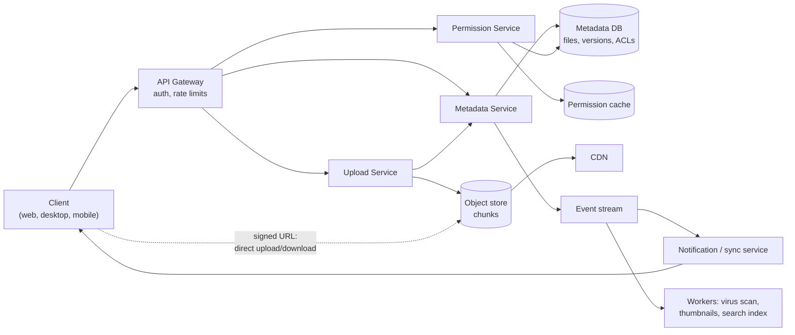

---
tags:
  - "system-design"
---
## Interview Question

Design a **file storage system similar to Google Drive**.

Follow-up questions asked:

1. How would you handle file operations such as upload, download and sharing?
2. How would you handle user permissions with respect to file versioning, security enforcement and data integrity?
3. How would you maintain multiple versions of the same file?
4. How would you implement owner, editor and viewer permissions?
5. Can permissions be assigned to both individual users and groups?
6. What happens if two users edit or upload the same file at the same time?

The design below is a preparation answer, not a record of what was said in the interview or of how Google Drive is built internally. Google Drive's public role model and Amazon S3's multipart-upload behaviour were checked on **27 September 2026**.

## Requirements

**Functional**

- Upload, download, rename, move and delete files and folders.
- Share files and folders with users, groups or a link, as owner, editor or viewer.
- Keep a version history and restore old versions.
- Sync changes across a user's devices.

**Non-functional**

- **Durability:** never lose an acknowledged file; replicate across failure domains.
- **Availability:** reads and downloads stay up even if metadata writes degrade.
- **Consistency:** strong consistency for metadata and permissions (a revoked user must lose access immediately); file bytes are immutable, so they can be cached freely.
- **Scale:** large files (GBs), unreliable mobile networks, many small metadata operations.

## High-Level Architecture

The key idea is to **separate metadata from content**. Metadata (names, folders, versions, permissions) is small, relational and needs transactions. Content is large, immutable blobs that belong in an object store.

- **Metadata Service** owns the file tree and version records in a sharded relational database.
- **Permission Service** answers "can principal P do action A on resource R?" and caches results.
- **Object store** (for example, S3 or Google Cloud Storage) holds immutable, content-addressed chunks.
- **Event stream** fans out changes to other devices, search indexing and background workers.

## Data Model

| Table | Key columns |
|---|---|
| `files` | `file_id`, `parent_id`, `name`, `owner_id`, `current_version_id`, `version_no`, `is_deleted` |
| `file_versions` | `version_id`, `file_id`, `version_no`, `created_by`, `created_at`, `size`, `checksum` |
| `version_chunks` | `version_id`, `chunk_index`, `chunk_hash` |
| `chunks` | `chunk_hash`, `storage_key`, `size`, `ref_count` |
| `permissions` | `resource_id`, `principal_type` (user, group, domain, anyone), `principal_id`, `role` |
| `group_members` | `group_id`, `user_id` |

Versions and chunks are **immutable**; only `files.current_version_id` changes.

## Q1: Upload, Download and Sharing

### Upload

1. The client splits the file into chunks (for example, 4–8 MB) and computes a SHA-256 hash per chunk.
2. It asks the Upload Service which hashes the server already has. Only missing chunks are uploaded; this gives **deduplication** and makes small edits to big files cheap.
3. The service returns **short-lived signed URLs**, and the client uploads chunks **directly to the object store**, in parallel, retrying only failed chunks. S3's multipart upload works this way: parts are uploaded independently, in any order, and a failed part can be retransmitted without restarting the whole upload.[^s3-mpu]
4. The client calls *commit* with the ordered list of chunk hashes and the whole-file checksum. The Metadata Service verifies the chunks exist and match, then creates a new version in one transaction.
5. An event triggers virus scanning, thumbnails and search indexing.

Incomplete uploads are garbage-collected after a timeout; S3, for example, keeps and bills for parts until the upload is completed or aborted.[^s3-mpu]

### Download

1. The client requests a file; the gateway authenticates it and the Permission Service checks read access.
2. The Metadata Service returns the chunk manifest for the requested version, with signed URLs.
3. The client downloads chunks in parallel (through the CDN for popular files) and verifies each hash. HTTP range requests support resume.

### Sharing

Sharing is a **metadata write**: insert a row into `permissions`. No bytes are copied. A link share is a permission for principal type `anyone` (optionally restricted to a domain), with an unguessable token. The recipient gets a notification through the event stream.

## Q2: Permissions, Versioning, Security and Integrity

- **Permissions and versioning:** permissions attach to the **file**, not to each version, so revoking access removes access to the whole history. Seeing history requires edit rights: in Google Drive, accessing historical revisions is allowed for owners and editors, not for commenters or viewers.[^drive-roles]
- **Security enforcement:**
  - Authenticate every request (OAuth tokens) at the gateway.
  - Check authorisation on **every** metadata and download request in the Permission Service, never only in the client.
  - Signed URLs expire in minutes and are scoped to one object, so a leaked URL has limited value.
  - Encrypt in transit (TLS) and at rest (per-object keys managed by a key management service).
  - Write an audit log of access and permission changes.
- **Data integrity:**
  - Hash chunks on the client, verify on the server, and store the checksum. S3, for example, compares a supplied full-object checksum with its own and rejects the upload on mismatch.[^s3-mpu]
  - Verify again on download, and scrub stored replicas in the background.
  - Commit versions in a single metadata transaction so a file never points at a half-uploaded version.

## Q3: Multiple Versions of the Same File

- Each save creates a new immutable `file_versions` row with its own chunk list; `files.current_version_id` points at the latest.
- Because chunks are content-addressed, a new version stores only **changed chunks**; unchanged chunks are shared between versions via `ref_count`.
- **Restore** creates a new version whose chunk list copies an old one, so history is never rewritten.
- **Retention:** keep the last N versions or versions from the last D days; a background job deletes expired versions and frees chunks whose `ref_count` reaches zero.

### Worked Example: Storage for a Small Edit

**Inputs:** a 100 MB file, 4 MB chunks, and an edit that changes bytes within one chunk.

**Step 1: number of chunks.**

$$
\left\lceil \frac{100}{4} \right\rceil = 25
$$

**Step 2: data uploaded for the new version.**

$$
1 \times 4 \text{ MB} = 4 \text{ MB}
$$

The new version costs 4 MB of storage and bandwidth instead of 100 MB. The caveat is that an insertion near the start shifts every later fixed-size chunk boundary; content-defined chunking (boundaries chosen by a rolling hash) avoids this.

## Q4: Owner, Editor and Viewer Permissions

Roles are ordered, and each includes the rights of the roles below it:

| Role | Read | Comment | Edit content, see history | Share | Delete permanently, transfer ownership |
|---|---|---|---|---|---|
| Owner | Yes | Yes | Yes | Yes | Yes |
| Editor | Yes | Yes | Yes | Configurable | No |
| Viewer | Yes | No | No | No | No |

Google Drive's API uses the same idea with the roles `owner`, `writer` (Editor in the UI), `commenter` and `reader` (Viewer).[^drive-roles]

- Exactly **one owner** per file; ownership transfer is an explicit, audited operation.
- **Folder inheritance:** a permission on a folder applies to everything under it. The effective role on a file is the highest role from the file itself and any ancestor folder.
- Check the action, not the role name, in code: map each API action (`read`, `update_content`, `share`, `delete`) to the minimum role it needs.

## Q5: Permissions for Users and Groups

Yes. `permissions.principal_type` can be a user, group, domain or `anyone`. Google Drive grants roles to users, groups and service accounts in the same way.[^drive-roles]

**Effective role** for user $u$ on file $f$: collect permissions whose principal is $u$, any group containing $u$, $u$'s domain or `anyone`, on $f$ or any ancestor folder, and take the highest role.

- **Nested groups:** expand membership with a bounded traversal and cache the flattened membership.
- **Caching:** cache effective roles per `(user, resource)` with a short TTL, and **invalidate on permission or membership change** through the event stream, so revocation takes effect quickly.
- **Explicit deny** is usually avoided because it makes the rules hard to reason about; if needed, deny should override allow.
- At very large scale, a relationship-based authorisation service such as Google's Zanzibar design generalises this model (see Open Questions).

## Q6: Two Users Editing or Uploading the Same File

**Binary files (uploads):** use **optimistic concurrency control**.

1. Each client reads `version_no` (or an ETag) when it starts editing.
2. On commit, it sends `If-Match: <version_no>`. The Metadata Service updates the row only if the version is unchanged, using a conditional update in one transaction.
3. The first commit wins. The second gets a conflict error (HTTP 412 Precondition Failed or 409 Conflict).
4. The losing client does not overwrite: it saves its work as a new version or a **conflicted copy** ("report (Alice's conflicted copy).docx") and tells the user.

Without this check, the result is last-writer-wins, and one user's changes are silently lost. S3 shows the ambiguity: with versioning on, concurrent multipart uploads to the same key each create a version, and the current version is the one whose upload **started** most recently, not the one that finished last.[^s3-mpu]

**Collaborative documents (Google Docs style):** locking or conflicted copies are poor experiences for real-time co-editing. Instead, clients send small operations to a document server that merges them with **operational transformation (OT)** or **conflict-free replicated data types (CRDTs)**, so both users' edits survive.

**Pessimistic locking** (check-out/check-in) is an alternative for files that cannot be merged, such as CAD files. Locks need a lease timeout so a crashed client does not hold them forever.

## Limitations & Pitfalls

- Permission checks on every request can dominate latency; caching helps but makes revocation lag, so keep TTLs short and invalidate on change.
- Deduplication across users can leak information (a user can test whether someone else stored a file) unless it is limited per user or tenant.
- Deep folder trees make inherited-permission checks and moves expensive; a move changes the effective permissions of the whole subtree.

## Open Questions

- TODO: capacity estimates (users, storage, QPS) were not discussed; add them if the interviewer asks for back-of-the-envelope numbers.
- TODO: read the Zanzibar paper (Pang et al., 2019) and summarise it; it was not opened for this note.

## References & Useful Links

[^drive-roles]: [Google Drive API: Roles and permissions](https://developers.google.com/workspace/drive/api/guides/ref-roles) — Roles granted to users, groups and service accounts; `owner`, `writer`, `commenter` and `reader` and their UI names; which roles can access historical revisions, share and delete.
[^s3-mpu]: [Amazon S3: Uploading and copying objects using multipart upload](https://docs.aws.amazon.com/AmazonS3/latest/userguide/mpuoverview.html) — Independent, retryable, parallel parts; completion and abort; checksum validation; concurrent uploads to the same key under versioning.
