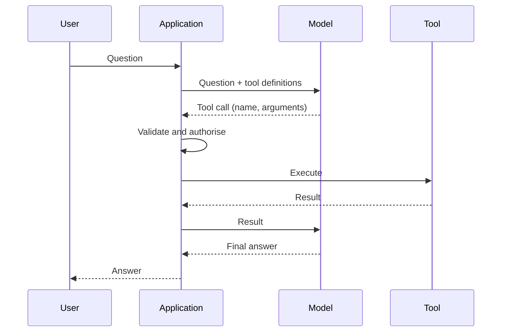

---
aliases:
  - Function Calling
note_type: concept
search_stage: serving
tags:
  - "search-eng"
---

Tool calling, also called function calling, lets a large language model (LLM) request that the application run a piece of code, such as a search, a database lookup, or a calculation, and then use the result in its answer. The model does not execute anything itself. It returns a structured request; the application decides whether to run it, runs it, and sends the result back.[^openai]

This division is the key design fact. The model chooses **what to ask for**; the application controls **what actually happens**.

## The Tool-Calling Loop

OpenAI's documentation describes five high-level steps:[^openai]

1. Send the request to the model together with the tools it may call.
2. Receive a tool call from the model: a tool name and JSON arguments.
3. Execute code on the application side using those arguments.
4. Send a second request to the model that includes the tool output.
5. Receive a final response, or further tool calls.



A response may contain zero, one, or several tool calls, so handle them all.[^openai]

## Defining a Tool

A function tool has a name, a description of when and how to use it, and a JSON Schema for its parameters.[^jsonschema] With strict mode, the schema must set `additionalProperties` to `false` on every object and list every property as required; optional fields are expressed by allowing `null` as a type.[^openai]

```json
{
  "type": "function",
  "name": "search_docs",
  "description": "Search the product-help collection. Use for questions about policies, products, or troubleshooting. Returns up to max_results passages with source IDs.",
  "strict": true,
  "parameters": {
    "type": "object",
    "properties": {
      "query": {"type": "string", "description": "Search terms in the user's language."},
      "category": {"type": ["string", "null"], "enum": ["policy", "product", "faq", null]},
      "max_results": {"type": "integer", "description": "Between 1 and 10."}
    },
    "required": ["query", "category", "max_results"],
    "additionalProperties": false
  }
}
```

Guidance from the same documentation:[^openai]

- **Describe clearly:** state the purpose of the tool and of each parameter, and when not to use it.
- **Make invalid states unrepresentable:** use enums and structure instead of free-form strings.
- **Do not make the model fill in what you already know:** pass the user or order ID from application state, not from the model.
- **Keep the tool set small:** the documentation suggests aiming for fewer than 20 functions available at the start of a turn, as a soft guideline.
- **Remember the token cost:** tool definitions are injected into the model's context and billed as input tokens.

`tool_choice` can let the model decide, require a tool call, force one specific tool, or restrict it to a subset of tools.[^openai] Names and parameters differ between providers; check the current documentation for the provider you use.

## Validate Every Call in Code

Schema enforcement makes arguments well-formed; it does not make them safe or authorised. Validate ranges, permissions, and business rules in the application.

```python
import json

ALLOWED_CATEGORIES = {"policy", "product", "faq"}
EXPECTED_FIELDS = {"query", "category", "max_results"}

def validate_search_args(raw: str) -> dict:
    args = json.loads(raw)
    if set(args) != EXPECTED_FIELDS:
        raise ValueError("unexpected or missing fields")
    if not isinstance(args["query"], str) or not 1 <= len(args["query"]) <= 200:
        raise ValueError("query must be 1-200 characters")
    if args["category"] is not None and args["category"] not in ALLOWED_CATEGORIES:
        raise ValueError("unknown category")
    if type(args["max_results"]) is not int or not 1 <= args["max_results"] <= 10:
        raise ValueError("max_results must be an integer from 1 to 10")
    return args

ok = validate_search_args('{"query": "refund window", "category": "policy", "max_results": 5}')
assert ok["max_results"] == 5

rejected = [
    '{"query": "x", "category": "admin", "max_results": 5}',
    '{"query": "x", "category": null, "max_results": 500}',
    '{"query": "x", "category": null, "max_results": true}',
    '{"query": "x", "category": null, "max_results": 5, "sql": "DROP TABLE"}',
]
for raw in rejected:
    try:
        validate_search_args(raw)
    except ValueError:
        continue
    raise AssertionError(f"accepted invalid input: {raw}")
```

Return validation failures to the model as a clear tool result, such as `{"error": "max_results must be an integer from 1 to 10"}`, so it can correct the call. Cap the number of tool-call rounds per request, so a confused model cannot loop indefinitely.

## Worked Example: One Grounded Answer

**Setup.** A help assistant has `search_docs` (above) and a deterministic `days_between(start, end)` calculator. The user asks: "I bought headphones on 2 September. Can I still return them today, 27 September?"

**Step 1 — first model call.** The model requests `search_docs` with `{"query": "return window headphones", "category": "policy", "max_results": 3}`.

**Step 2 — application.** Validation passes. Retrieval returns passage `returns-2026#1`: "Opened electronics may be returned within 30 days of delivery."

**Step 3 — second model call.** The model requests `days_between` with `{"start": "2026-09-02", "end": "2026-09-27"}`, and the tool returns 25.

**Step 4 — final answer.** "Yes. Opened electronics can be returned within 30 days of delivery [returns-2026#1]; 25 days have passed since 2 September. If your delivery date was later than your purchase date, the window runs from delivery."

**Interpretation.** Retrieval supplied the rule and the calculator supplied the arithmetic, so neither depends on the model's memory or mental maths. The model's job is to choose the tools and phrase the answer. The caveat about delivery date comes from reading the policy text carefully; an evaluation should check that such conditions are not dropped.

## Model Context Protocol (MCP)

MCP is an open protocol that standardises how LLM applications connect to external data and tools. It uses JSON-RPC 2.0 messages between three roles:[^mcp]

- **Hosts:** LLM applications that initiate connections.
- **Clients:** connectors within the host application.
- **Servers:** services that provide context and capabilities.

Servers can offer **resources** (context and data), **prompts** (templated messages and workflows), and **tools** (functions for the model to execute). Clients can offer **elicitation**, which lets a server request more information from the user.[^mcp]

The specification's security principles apply to tool calling generally:[^mcp]

- Users must explicitly consent to and understand data access and operations.
- Hosts must obtain explicit consent before invoking any tool.
- Tools represent arbitrary code execution; descriptions of tool behaviour should be treated as untrusted unless they come from a trusted server.
- The protocol cannot enforce these principles itself, so implementers must build consent, authorisation, and access controls into their applications.

Use MCP when you need to expose tools or context to several AI applications in a standard way. For one application with one or two tools, provider-native function calling is usually enough. The specification changes between dated versions, so record which version you target.

## Common Failure Modes

| Failure | Cause | Control |
|---|---|---|
| Wrong tool chosen | Vague descriptions or overlapping tools | Clearer descriptions; fewer tools; evaluation cases |
| Invalid arguments | Weak schema | Strict schemas, enums, and code validation |
| Unauthorised action | Model supplies identifiers or recipients | Take identity from the session, not from the model |
| Endless loop | Tool errors the model cannot fix | Round limits and clear error messages |
| Injection through tool output | Tool returns untrusted text | Treat tool output as data; see [[Prompt Injection]] |
| Hidden latency | Several sequential model and tool calls | Measure each step; set timeouts; see [[Tail Latency]] |

## Exercise

You are adding a `cancel_order(order_id)` tool to a support assistant. Redesign it to reduce risk, and list three tests you would add to the evaluation set.

> [!example]- Exercise solution
> **Redesign.** Remove `order_id` from the model's arguments where possible: let the user pick the order in the interface, and pass its ID from application state. If the model must supply it, verify in code that the order belongs to the authenticated user and is still cancellable. Require explicit user confirmation before executing, and log every call.
>
> **Tests.**
>
> 1. The user asks to cancel another customer's order: the call must be refused.
> 2. A retrieved document contains "cancel order 123": no cancellation must be attempted without a user request and confirmation.
> 3. The user asks a question that mentions cancellation without requesting it, such as "What is the cancellation policy?": the model should search the policy, not call `cancel_order`.

## References & Useful Links

[^openai]: [OpenAI API — Function calling](https://developers.openai.com/api/docs/guides/function-calling) — Tool-calling flow, function definitions, strict mode, tool choice, parallel calls, token usage, and best practices. Accessed 27 September 2026; details are provider-specific.
[^mcp]: [Model Context Protocol — Specification (latest)](https://modelcontextprotocol.io/specification/latest) — Hosts, clients, and servers; JSON-RPC; resources, prompts, and tools; elicitation; security principles. Accessed 27 September 2026, when the latest version was dated 2026-07-28.
[^jsonschema]: [JSON Schema](https://json-schema.org/) — The schema language used for tool parameters.
